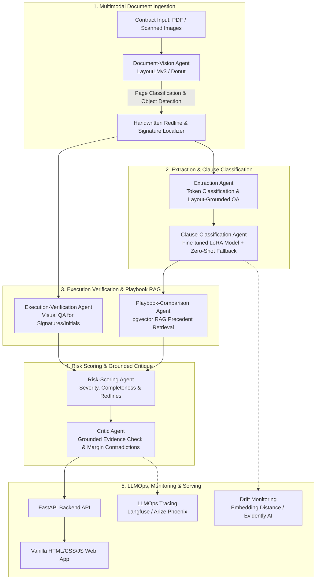

 Multi-Agent, Multimodal Contract Risk Intelligence System


This project is an enterprise-grade, multi-agent, and genuinely multimodal legal contract risk intelligence platform. Unlike standard text-only contract review tools or generic wrapper chatbots, ClauseIQ combines **document vision-language models** (to inspect scanned pages, handwriting, redline annotations, and signatures), a **fine-tuned LoRA clause classifier** benchmarked on the published **CUAD** dataset, a **7-agent LangGraph orchestration pipeline**, **pgvector RAG** precedent matching, **LLMOps observability**, and **embedding drift monitoring** served via a modern **Vanilla HTML/CSS/JS frontend**.

---

## Why this project Stands Out

1. **Genuine Multimodality Solving a Real Problem**:
   - Detecting missing initials in signature blocks or handwritten margin redlines that contradict typed clauses below them requires looking at the actual page image layout, handwriting location, and visual structure not just extracted OCR text.
2. **Fine-Tuning vs. Prompting**:
   - Instead of sending every clause to an expensive LLM for basic classification, ClauseIQ fine-tunes a specialized LoRA adapter on **ModernBERT/DistilBERT** using the **CUAD (Contract Understanding Atticus Dataset)** benchmark (510 contracts, 13,000+ expert annotations, 41 clause categories).
3. **Multi-Agent Orchestration**:
   - A 7-agent **LangGraph** workflow coordinates visual layout analysis, clause classification, execution completeness verification, playbook RAG retrieval, risk scoring, and evidence-grounded critique.
4. **Production Readiness**:
   - Built with end-to-end LLMOps observability (**Langfuse / Arize Phoenix**), embedding drift monitoring (**Evidently AI**), and an asynchronous **FastAPI** backend with a high-performance **Vanilla HTML/CSS/JS** interactive UI.

---

## System Architecture



---

## The 7-Agent LangGraph Workflow

1. **Document-Vision Agent (`src/agents/vision_agent.py`)**
   - Processes scanned page images using a document vision-language model (`LayoutLMv3` / `Donut`).
   - Classifies page types (*Cover*, *Body*, *Signature/Execution*, *Exhibit*) and localizes handwritten vs. typed regions and signature/stamp blocks.
2. **Extraction Agent (`src/agents/extraction_agent.py`)**
   - Pulls clause text, parties, dates, and amounts using layout-grounded Document QA and Token Classification.
3. **Clause-Classification Agent (`src/agents/classification_agent.py`)**
   - Invokes the fine-tuned LoRA model (`src/nlp/classifier.py`) to tag clauses into 41 standard CUAD legal categories, falling back to a zero-shot classifier for out-of-distribution clauses.
4. **Execution-Verification Agent (`src/agents/verification_agent.py`)**
   - Performs Visual QA (VQA) to verify that every page requiring a signature or initial actually has one and that signatories match named parties.
5. **Playbook-Comparison Agent (`src/agents/playbook_agent.py`)**
   - Queries `pgvector` RAG (`src/rag/`) to retrieve firm precedent language for each clause type and computes semantic deviation.
6. **Risk-Scoring Agent (`src/agents/risk_agent.py`)**
   - Synthesizes semantic deviation severity, execution completeness gaps, and clause criticality into a quantitative risk score and drafts redline suggestions.
7. **Critic Agent (`src/agents/critic_agent.py`)**
   - Verifies that every flagged risk is grounded in retrieved playbook evidence and catches handwritten-vs-typed contradictions (e.g., a margin note altering liability caps that was never incorporated into the typed text).

---

## Recommended Tech Stack

| Layer | Technology Choice | Rationale |
| :--- | :--- | :--- |
| **Document Vision Model** | LayoutLMv3 / Donut | Joint layout + visual + text understanding of scanned contract pages |
| **Fine-Tuning** | HF Transformers + PEFT/LoRA (DistilBERT / ModernBERT) | Fast, efficient, and benchmarked against standard legal NLP tasks |
| **Benchmark Dataset** | **CUAD** (Contract Understanding Atticus Dataset) | Externally published legal benchmark with 13,000+ expert annotations |
| **Vision Eval Set** | Simulated Scanned Contracts (Handwritten Redlines / Signatures) | Targets execution gaps and handwritten markup invisible to text-only tools |
| **Orchestration** | LangGraph + LangChain | Robust stateful multi-agent coordination with cycles and critique loops |
| **Vector Store** | PostgreSQL + pgvector | High-performance vector similarity search for legal playbook precedents |
| **Reasoning LLM** | Claude 3.5 Sonnet / GPT-4o-mini | Deep reasoning for risk analysis, redline drafting, and grounded critique |
| **Drift Monitoring** | Evidently AI / Embedding-distance monitor | Detects shifts in incoming contract distributions from baseline training sets |
| **LLMOps & Tracing** | Langfuse / Arize Phoenix | Full observability into agent steps, latency, prompt versioning, and cost |
| **API & Frontend** | FastAPI + Vanilla HTML/CSS/JS | Lightweight, responsive, high-performance web dashboard without framework bloat |

---

## Project Directory Structure

```
d:/projects/contract risk system multi agent multi modal/
│
├── README.md                          # Project overview & setup instructions
├── pyproject.toml                     # Python packaging & dependencies
├── requirements.txt                   # Requirements lock file
├── .env.example                       # Environment variables template
├── docker-compose.yml                 # pgvector and observability stack
├── Dockerfile                         # Container build config
├── .gitignore                         # Git exclusion rules
│
├── config/                            # Application & Agent Configurations
│   ├── __init__.py
│   ├── settings.py                    # Main app settings & pydantic config
│   ├── agent_config.yaml              # Prompts & agent parameters
│   └── playbook_rules.yaml            # Default legal playbook risk rules
│
├── data/                              # Datasets & sample files
│   ├── cuad/                          # CUAD dataset storage / loaders
│   ├── sample_contracts/              # Sample PDFs/scanned images
│   └── playbooks/                     # Playbook precedent texts
│
├── frontend/                          # Rich Vanilla HTML/CSS/JS Web Application
│   ├── index.html                     # Main dashboard & contract inspection interface
│   ├── css/
│   │   ├── index.css                  # Core design tokens, dark mode & glassmorphism
│   │   ├── layout.css                 # Responsive grid & viewer layout
│   │   └── components.css             # Risk badges, redline cards & modal styles
│   ├── js/
│   │   ├── app.js                     # Main UI state & FastAPI backend communication
│   │   ├── viewer.js                  # Document image viewer & redline bounding box canvas
│   │   └── report.js                  # Interactive risk scorecard & redline renderer
│   └── assets/
│       └── logo.svg                   # Brand icon / logo
│
├── src/                               # Primary source code package
│   ├── __init__.py
│   │
│   ├── vision/                        # Multimodal & Vision Layer
│   │   ├── __init__.py
│   │   ├── classifier.py              # Page-type classification (LayoutLMv3/Donut)
│   │   ├── detector.py                # Signature & handwritten markup detection
│   │   ├── vqa.py                     # Visual QA for execution completeness
│   │   └── ocr_layout.py              # Layout-grounded text extraction
│   │
│   ├── nlp/                           # Clause Classification & NLP
│   │   ├── __init__.py
│   │   ├── classifier.py              # Fine-tuned LoRA classifier inference
│   │   ├── zero_shot.py               # Zero-shot fallback classifier
│   │   └── entities.py                # Token classification (parties, dates, amounts)
│   │
│   ├── rag/                           # Vector Store & Playbook Precedent RAG
│   │   ├── __init__.py
│   │   ├── pgvector_store.py          # pgvector connection & CRUD
│   │   ├── embeddings.py              # Embedding generation & similarity
│   │   └── retriever.py               # Playbook precedent retriever
│   │
│   ├── agents/                        # The 7 LangGraph Agents
│   │   ├── __init__.py
│   │   ├── state.py                   # Shared LangGraph state schemas (Pydantic)
│   │   ├── vision_agent.py            # 1. Document-Vision Agent
│   │   ├── extraction_agent.py        # 2. Extraction Agent
│   │   ├── classification_agent.py    # 3. Clause-Classification Agent
│   │   ├── verification_agent.py      # 4. Execution-Verification Agent
│   │   ├── playbook_agent.py          # 5. Playbook-Comparison Agent
│   │   ├── risk_agent.py              # 6. Risk-Scoring Agent
│   │   └── critic_agent.py            # 7. Grounded Critic Agent
│   │
│   ├── orchestration/                 # LangGraph Pipeline Wiring
│   │   ├── __init__.py
│   │   ├── graph.py                   # LangGraph workflow definition & edges
│   │   └── runner.py                  # End-to-end execution helper
│   │
│   ├── ops/                           # LLMOps & Drift Monitoring
│   │   ├── __init__.py
│   │   ├── tracing.py                 # Langfuse / Arize Phoenix hooks
│   │   ├── drift.py                   # Embedding distance & Evidently AI monitoring
│   │   └── logger.py                  # Structured logging
│   │
│   └── api/                           # FastAPI Backend Services
│       ├── __init__.py
│       ├── main.py                    # FastAPI app entrypoint (serving API & static frontend)
│       ├── routers/
│       │   ├── __init__.py
│       │   ├── contract_router.py     # Upload and analysis endpoints
│       │   └── health_router.py       # Health check endpoints
│       └── schemas/
│           ├── __init__.py
│           └── contract_schema.py     # API request/response models
│
├── scripts/                           # Training, Indexing & Evaluation Scripts
│   ├── __init__.py
│   ├── train_lora_cuad.py             # Fine-tune LoRA on CUAD dataset
│   ├── index_playbook.py              # Seed pgvector with playbook clauses
│   ├── evaluate_cuad.py               # Benchmark text classification (F1/Recall)
│   └── evaluate_vision.py             # Benchmark vision execution/redline recall
│
├── tests/                             # Unit & Integration Tests
│   ├── __init__.py
│   ├── test_vision.py                 # Test vision detectors & VQA stubs
│   ├── test_nlp.py                    # Test clause classifier & fallback
│   ├── test_rag.py                    # Test RAG retrieval & similarity
│   └── test_graph.py                  # Test LangGraph 7-agent state flow
│
└── notebooks/                         # Exploratory Notebooks & Prototyping
    ├── 01_cuad_dataset_exploration.ipynb
    ├── 02_vision_layoutlmv3_experiments.ipynb
    └── 03_langgraph_pipeline_trace.ipynb
```

---

## Getting Started

### 1. Prerequisites
- Python 3.11 or higher
- Docker & Docker Compose (for `pgvector` and local LLMOps observability)

### 2. Environment Setup
Clone the repository and install dependencies:
```bash
git clone https://github.com/your-username/clauseiq.git
cd clauseiq

# Create virtual environment
python -m venv venv
source venv/bin/activate  # On Windows: venv\Scripts\activate

# Install requirements
pip install -r requirements.txt
```

### 3. Configure Environment Variables
Copy `.env.example` to `.env` and set your API keys:
```bash
cp .env.example .env
```

### 4. Start Infrastructure (pgvector)
Launch PostgreSQL with `pgvector`:
```bash
docker-compose up -d pgvector
```

### 5. Run FastAPI Server & Web App
Start the FastAPI server, which serves both the REST API and the interactive Vanilla HTML/CSS/JS frontend:
```bash
uvicorn src.api.main:app --reload --host 0.0.0.0 --port 8000
```
Open your browser at `http://localhost:8000` to interact with the ClauseIQ UI.

---

## Evaluation & Metrics

- **Text Classification**: Evaluation against the 41 CUAD legal categories using F1, precision, and recall via `scripts/evaluate_cuad.py`.
- **Vision & Multimodal Verification**: Custom precision/recall metrics for execution signature completeness and handwritten-redline detection via `scripts/evaluate_vision.py`.
- **Drift Detection**: Automated alert generation when embedding distance of incoming contract language diverges significantly from baseline training distributions.

---


